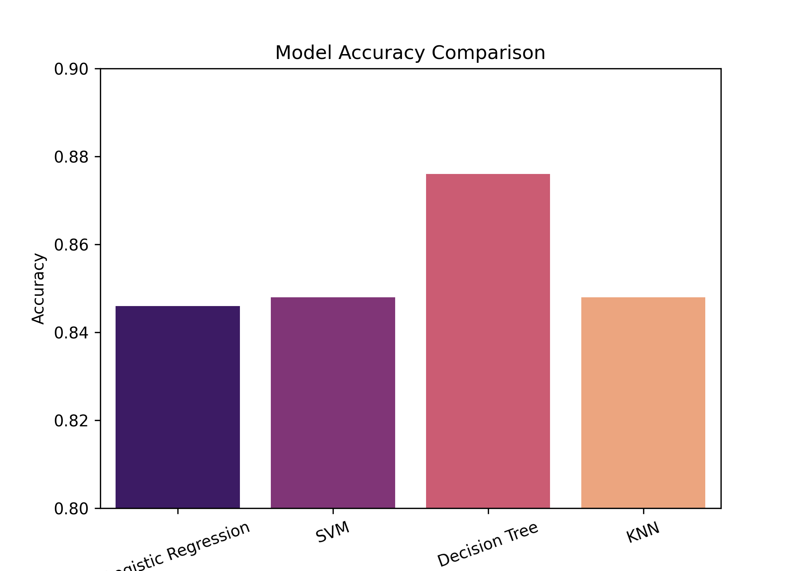

# DS_SpaceX_Falcon_9_first_stage_Landing_Prediction
## Introduction
A Data Science project focused on analyzing SpaceX launch data to gain insights into launch outcomes, predict success rates, and visualize key trends. This project leverages Python, data wrangling, machine learning, and interactive visualizations.

## Project Overview

The goal of this project is to:
1. Collect and preprocess SpaceX launch data (via APIs, CSV, or web scraping).
2. Perform Exploratory Data Analysis (EDA) to understand patterns in launch outcomes.
3. Build and evaluate Machine Learning models to predict launch success.
4. Visualize findings through plots, dashboards, and interactive tools.
   
### Problem 

The key problem is predicting the landing success of the Falcon 9 first stage based on specific flight features.
(The launch success rate may dependon many factors such as payload mass, orbit type, and so on. It may alsodepend on the location and proximities of a launch site, i.e., the initialposition of rocket trajectories. Finding an optimal location for building alaunch site certainly involves many factors and hopefully we could discoversome of the factors by analyzing the existing launch site locations. Findingbest fit ML model is also important.)

### Documentation 

You can find the presentation, analysis and insights of this project in here: ['DS_SpaceX.pdf'](DS_SpaceX.pdf) 

## Visualizations from EDA

The image shows a scatter plot of Flight Number vs. Launch Site

In the Payload Mass Vs. Launch Site scatter point chart the VAFB-SLClaunchsite there are no rockets launched for heavypayload mass(greater than10000)

The below figure displays bar chart for the success rate of each orbit type

The scaller plot shows that, in the LEO orbit success seems to be related to the number of flights. Conversely, in the GTO orbit, there appears to be no relationship between flight number and success

With heavy payloads the successful landing or positive landing rate are more for Polar,LEO and ISS. 

• However, for GTO, it's difficult to distinguish between successful and unsuccessful landings as both outcomes are present.

Launch Success Yearly Trend shows a line chart of yearly average success rate. I observe that the sucess rate since 2013 kept increasing till 2020

Bar graph for the built model accuracy for all built classification models is as shown in the figure.

• The decision tree model hashighest accuracy.

This is the confusion matrix of the best performing model.

• The best performing model is Decision tree with model accuracy of 87 percent and accuracy on test as 94 percent

## Visualizations from Plotly

Piechart for The Highest Launch Success Site

### Scatter plot

The scatter plot of payload and success class

## Conclusion

Success rates increase over time, across all factors, which indicates continuous and incremental operational improvements and technological advancements. Different orbits have varying success rates, with ES-L1, SSO, HEO, and GEO showing consistently successfuloutcomes. Launch site was a highly predictive factor, with KSC LC-39A being a top performer, closely followed by CCAFS LC-40. Many of the predictive models evaluated were able to predict landing outcome with an acceptable level of accuracy. In the testing performed, DecisionTreeClassifier produced best results with high accuracy, precision, and recall.
